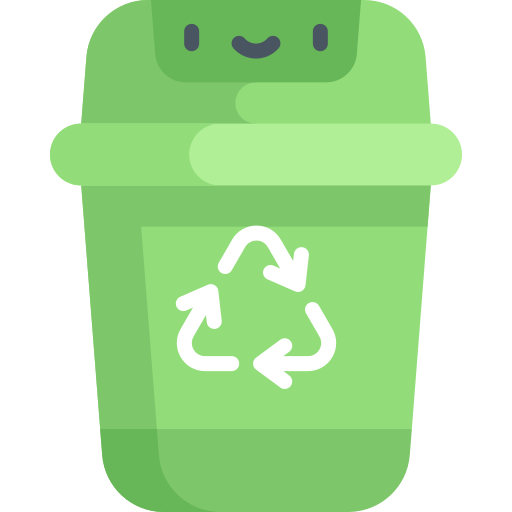

<a name="readme-top"></a>
<!--
*** Readme template from: https://github.com/othneildrew/Best-README-Template/
-->


<!-- PROJECT SHIELDS -->
<!--
*** I'm using markdown "reference style" links for readability.
*** Reference links are enclosed in brackets [ ] instead of parentheses ( ).
*** See the bottom of this document for the declaration of the reference variables
*** for contributors-url, forks-url, etc. This is an optional, concise syntax you may use.
*** https://www.markdownguide.org/basic-syntax/#reference-style-links
-->

![year][year-shield]
![Contributors][contributors-shield]
![python][python-shield]


<!-- PROJECT LOGO -->
<div align="center">
  <a href="https://github.com/kt_tran/Bindicator">
    
  </a>

<h3 align="center">Bindicator</h3>
  <p align="center">
    An adorable bin day reminder
  </p>
</div>


<!-- TABLE OF CONTENTS -->
<details>
  <summary>Table of Contents</summary>
  <ol>
    <li>
      <a href="#about-the-project">About The Project</a>
      <ul>
        <li><a href="#built-with">Built With</a></li>
      </ul>
    </li>
    <li>
      <a href="#getting-started">Getting Started</a>
      <ul>
        <li><a href="#prerequisites">Prerequisites</a></li>
        <li><a href="#installation">Installation</a></li>
      </ul>
    </li>
    <li><a href="#usage">Usage</a></li>
    <li><a href="#roadmap">Roadmap</a></li>
    <li><a href="#acknowledgments">Acknowledgments</a></li>
  </ol>
</details>


<!-- ABOUT THE PROJECT -->
## About The Project

![Product Name Screen Shot][product-screenshot]

Inspired by a picture of Darren Tarbard's Bin Day Cator, I decided to create one of my own after finding a mini plastic bin for $5 at the store.
![Bin][bin-price]


<p align="right">(<a href="#readme-top">back to top</a>)</p>


<!-- Cron -->
## Using Cron

Cron is an in-built Linux utility that allows you to schedule jobs to run periodically. Cron is used to run the python file on bin day each week.
See: https://crontab.guru/

Store this:
  ```sh
  0 0 * * 2 /usr/bin/python /home/pi/Documents/ledSimple.py
  ```

in the crobtab (cron table) using:
  ```sh
  crontab -e
  ```

### Installation

1. Get a free API Key at [https://example.com](https://example.com)
2. Clone the repo
   ```sh
   git clone https://github.com/kt_tran/Bindicator.git
   ```
3. Install NPM packages
   ```sh
   npm install
   ```
4. Enter your API in `config.js`
   ```js
   const API_KEY = 'ENTER YOUR API';
   ```

<p align="right">(<a href="#readme-top">back to top</a>)</p>


<!-- USAGE EXAMPLES -->
## Usage

Use this space to show useful examples of how a project can be used. Additional screenshots, code examples and demos work well in this space. You may also link to more resources.

_For more examples, please refer to the [Documentation](https://example.com)_

<p align="right">(<a href="#readme-top">back to top</a>)</p>


<!-- ROADMAP -->
## Roadmap

- [ ] Feature 1
- [ ] Feature 2
- [ ] Feature 3
    - [ ] Nested Feature

See the [open issues](https://github.com/kt_tran/Bindicator/issues) for a full list of proposed features (and known issues).

<p align="right">(<a href="#readme-top">back to top</a>)</p>


<!-- ACKNOWLEDGMENTS -->
## Acknowledgments

* Idea: [Darren Tarbard](https://hackaday.com/2020/01/23/bindaycator-lets-you-know-when-to-take-out-the-trash/#:~:text=Having%20four%20LEDs%20both%20helps,segments%20in%20red%20and%20blue)
* Contributor: [Jamie Gee](https://https://github.com/gouu1)

<p align="right">(<a href="#readme-top">back to top</a>)</p>


<!-- MARKDOWN LINKS & IMAGES -->
<!-- https://www.markdownguide.org/basic-syntax/#reference-style-links -->
[contributors-shield]: https://img.shields.io/badge/Contributors-Katie,%20Jamie-blueviolet
[year-shield]: https://img.shields.io/badge/Year-2022-blue
[python-shield]: https://img.shields.io/badge/Python-brightgreen
[product-screenshot]: img/final.jpg
[bin-price]: img/bin_purchase.jpg